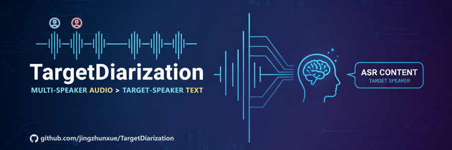

# TargetDiarization



[English](README.md) | [简体中文](README_zh.md)

TargetDiarization is a deep learning-based audio processing system designed to identify and extract the speech content of a specific target speaker from multi-speaker conversations. The system integrates multiple components including audio processing, speaker separation, automatic speech recognition (ASR), and speaker diarization. It can accurately isolate the target speaker’s speech from complex audio environments and convert it into text.

---

<p align="center">
  <a href="https://github.com/jingzhunxue/TargetDiarization">Homepage</a> •
  <a href="https://www.modelscope.cn/models/jzx-ai-lab/target_diarization_models">Models</a> •
  <a href="https://www.apache.org/licenses/LICENSE-2.0">License</a>
</p>

<p align="center">
  
  
  
  
</p>

---


## Quick Demo

https://github.com/user-attachments/assets/942ff51b-0fc0-4ce5-8798-e3fc49ede9a6

**↑ Please unmute the video above before playing ↑**

[Unable to play? Click here](https://www.modelscope.cn/models/jzx-ai-lab/target_diarization_models/resolve/master/assets/webui_demo.mp4)

- Task: Separate the target speaker’s audio from a multi-speaker mixture and perform ASR for all speakers in the audio.

- Input: Multi-speaker mixture audio and a pre-recorded target speaker sample.

- Output: Per-speaker diarization results and the separated target speaker audio.


## Project Highlights

- A highly engineered, integrated project built on open-source models, fusing multiple state-of-the-art (SOTA) models to ensure top performance across processing stages (separation, denoising, recognition, etc.).

- End-to-end solution from audio preprocessing to transcription, supporting both non-streaming and real-time streaming modes for diverse scenarios.

- Multiple access methods provided out of the box: command line, REST API, WebSocket, and web UI.

- Parameterized design allowing you to swap or tune models and parameters as needed.

- Modular architecture: Python files starting with an uppercase letter can be used as standalone packages and imported into your own projects.


## Changelog

- 2025.9.25: Initial release


## Architecture

The system adopts a multi-model fusion architecture:

- Endpoint detection: CAM++ Diarization

- Overlap detection: Pyannote Diarization

- Audio denoising: UVR-MDX-Net

- VAD: FSMN-Monophone VAD

- Speech separation: MossFormer2 (self-finetune version)

- Audio restoration: Apollo

- Speaker recognition: ERes2NetV2-Large

- ASR: Paraformer / Whisper / SenseVoice

- Punctuation restoration: CT-Transformer


## Quick Start

### Recommended Environment

- Python 3.10
- NVIDIA CUDA 12.1
- 16GB+ RAM
- 8GB+ VRAM


### Install Dependencies (Anaconda example)

* Create a virtual environment

  ```
  conda create -n target_diarization python=3.10
  ```

* Activate the environment

  ```
  conda activate target_diarization
  ```

* Install PyTorch and other dependencies

  ```
  conda install pytorch==2.2.2 torchaudio==2.2.2 pytorch-cuda=12.1 -c pytorch -c nvidia
  pip install -r requirements.txt
  ```


### Clone Codebase & Download Models

Clone codebase:

```
git clone https://github.com/jingzhunxue/TargetDiarization.git
```

Download all pretrained models:

```
git-lfs clone https://www.modelscope.cn/models/jzx-ai-lab/target_diarization_models.git
```

<IMPORTANT> Model directory structure:

```
TargetDiarization/
├── iic/
│   ├── punc_ct-transformer_zh-cn-common-vocab272727-pytorch/
│   ├── speech_campplus_speaker-diarization_common/
│   ├── speech_campplus_sv_zh-cn_16k-common/
│   ├── speech_eres2netv2w24s4ep4_sv_zh-cn_16k-common/
│   ├── speech_fsmn_vad_zh-cn-16k-common-pytorch/
│   └── speech_paraformer-large-vad-punc_asr_nat-zh-cn-16k-common-vocab8404-pytorch/
├── pyannote/
│   └── speaker-diarization-3.1/
├── checkpoints/
│   └── mossformer2-finetune/
├── mdx
│   └── weights/
├── JusperLee
│   └── Apollo/
├── main.py
└── ...
```


## Basic Usage

### 0. Startup Parameters

- Copy `.env.example` in the project to a new file named `.env`.

- Parameters in `.env` are initialization parameters. After the project starts, parameters are fixed; changes require a restart.

- Adjustable items include: model paths, model parameters, GPU device, disabled modules, etc.

### 1. Command Line

Non-streaming invocation:

```python
from TargetDiarization import TargetDiarization

# Initialize the pipeline
td = TargetDiarization(cuda_device=0)

# Process an audio file
target_spk, results, target_audio = td.infer(
    wav_file="conversation.wav",   # Input audio file to process
    target_file="target_speaker.wav"   # Target speaker sample (optional)
)

# Inspect results
for result in results:
    print(f"Speaker: {result['speaker']}")
    print(f"Time: {result['timerange']}")  
    print(f"Text: {result['text']}")
```


### 2. Gradio UI

Non-streaming demo only:

```bash
# Start the Gradio UI
python webui.py

# Open in browser: http://localhost:8300/target-diarization
```

Returned results:

```json
[
  {
    "speaker": "0",  // Speaker ID
    "timerange": [0.031, 1.702],   // Segment time range (seconds)
    "text": "Anyway, it’s just the freshman arrival.",   // ASR text (ASR model can be customized)
    "type": "single",   // Segment type (single = single speaker, overlap = overlapped)
    "score": 0.748   // Similarity score to target speaker (non-target = -1.0)
  },
  {...}
]
```


### 3. Web API Service

```bash
# Start the API service
python main.py

# Service URL: http://localhost:8000
# API Docs: http://localhost:8000/docs
```

Test API with curl (non-streaming):

```bash
curl -X POST "http://localhost:8000/diarization/infer" \
  -F "audio_file=@conversation.wav" \
  -F "target_file=@target_speaker.wav" \
  -F "sampling_rate=16000"
```

Open the web demo in a browser (non-streaming + streaming):

```bash
# Open: demo.html
```


## Advanced: API Details

### Start the Web Service

< Refer to: Basic Usage - Web API Service >


### HTTP Non-Streaming

#### 1. Health Check

```
GET /health
```

Check service status and model loading state.

**Response example:**

```json
{
  "status": "healthy",
  "model_loaded": true,
  "timestamp": 1703123456.789
}
```

#### 2. Audio Inference

```
POST /diarization/infer
```

Upload an audio file for speaker separation and ASR.

**Request parameters:**

- `audio_file` (file, required): Input audio file
- `target_file` (file, optional): Target speaker sample audio
- `sampling_rate` (int, default=16000): Audio sampling rate
- `is_single` (bool, default=false): Whether to use single-speaker mode
- `output_target_audio` (bool, default=true): Whether to return the target speaker audio

**Usage example:**

JavaScript fetch:

```javascript
const formData = new FormData();
formData.append('audio_file', audioFile);
formData.append('target_file', targetFile);  // optional
formData.append('sampling_rate', '16000');

fetch('http://localhost:8000/diarization/infer', {
    method: 'POST',
    body: formData
})
.then(response => response.json())
.then(data => console.log(data));
```

**Response format:**

```json
{
  "success": true,
  "data": {
    "target_speaker_id": "1",
    "total_speakers": 2,
    "results": [
      {
        "speaker": "1",
        "speaker_type": "target",
        "timerange": [0.0, 3.5],
        "text": "Hello, the weather is nice today.",
        "type": "single"
      },
      {
        "speaker": "0",
        "speaker_type": "other",
        "timerange": [3.5, 6.2],
        "text": "Yes, it’s great for going out.",
        "type": "single"
      }
    ],
    "statistics": {
      "total_duration": 15.3,
      "target_speaker_duration": 8.7,
      "other_speakers_duration": 6.6
    },
    "target_audio_base64": "UklGRiQAAABXQVZFZm10..."
  },
  "processing_time": 2.45
}
```


### WebSocket Streaming

#### Connection URL

```
WS /diarization/stream
```

WebSocket streaming supports real-time audio transmission and immediate result returns.

**Connection flow:**

1. **Establish connection**

```javascript
const websocket = new WebSocket('ws://localhost:8000/diarization/stream');
```

2. **Send configuration**

```javascript
const config = {
    type: "config",
    data: {
        sampling_rate: 16000,
        is_single: false,
        output_target_audio: false,
        has_target_file: true  // if a target sample is provided
    }
};
websocket.send(JSON.stringify(config));
```

3. **Send target audio (optional)**

```javascript
// Convert the audio file to base64
const targetAudioBase64 = await fileToBase64(targetFile);
websocket.send(JSON.stringify({
    type: "target_audio",
    data: targetAudioBase64
}));
```

4. **Send audio stream data**

```javascript
// Send an audio chunk
websocket.send(JSON.stringify({
    type: "audio_chunk",
    data: audioChunkBase64
}));

// End the audio stream
websocket.send(JSON.stringify({
    type: "audio_end"
}));
```

**Message formats:**

Configuration acknowledgment:

```json
{
  "type": "config_ack",
  "data": {
    "config": {...},
    "target_file_loaded": true
  }
}
```

Real-time result:

```json
{
  "type": "segment_result",
  "data": {
    "target_speaker_id": "1",
    "segment": {
      "speaker": "1",
      "speaker_type": "target",
      "timerange": [2.0, 4.5],
      "text": "This is real-time recognized text",
      "type": "single"
    }
  }
}
```

Status message:

```json
{
  "type": "status",
  "message": "completed"
}
```

Error message:

```json
{
  "type": "error",
  "message": "Error details"
}
```


## Acknowledgements

- [CAM++ Diarization](https://www.modelscope.cn/models/iic/speech_campplus_speaker-diarization_common)
- [Pyannote Diarization](https://www.modelscope.cn/models/pyannote/speaker-diarization-3.1)
- [FSMN-Monophone VAD](https://www.modelscope.cn/models/iic/speech_fsmn_vad_zh-cn-16k-common-pytorch)
- [Paraformer-Large](https://www.modelscope.cn/models/iic/speech_paraformer-large-vad-punc_asr_nat-zh-cn-16k-common-vocab8404-pytorch)
- [CT-Transformer](https://www.modelscope.cn/models/iic/punc_ct-transformer_zh-cn-common-vocab272727-pytorch)
- [ERes2NetV2-Large](https://www.modelscope.cn/models/iic/speech_eres2netv2w24s4ep4_sv_zh-cn_16k-common)
- [Apollo](https://huggingface.co/JusperLee/Apollo)
- [Look2hear](https://github.com/JusperLee/SonicSim/tree/main/separation/look2hear)
- [Ultimate Vocal Remover](https://github.com/Anjok07/ultimatevocalremovergui)


## License

Apache License 2.0 