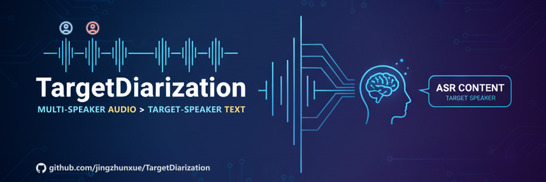

# TargetDiarization



[English](README.md) | [简体中文](README_zh.md)

TargetDiarization (目标说话人日志) 是一个基于深度学习的音频处理系统，用于从多人对话中识别和提取特定说话人的语音内容。系统集成了音频处理、说话人分离、语音文本识别、说话人日志等多项技术，可以准确地从复杂的音频环境中分离出目标说话人的语音并转换为文字。

---

<p align="center">
  <a href="https://github.com/jingzhunxue/TargetDiarization">Homepage</a> •
  <a href="https://www.modelscope.cn/models/jzx-ai-lab/target_diarization_models">Models</a> •
  <a href="https://www.apache.org/licenses/LICENSE-2.0">License</a>
</p>

<p align="center">
  
  
  
  
</p>

---


## 快速演示

<video width="100%" controls>
  <source src="https://raw.githubusercontent.com/jingzhunxue/TargetDiarization/refs/heads/main/assets/webui_demo.mp4" type="video/mp4" />
  您的浏览器不支持视频播放。可以下载后观看：assets/webui_demo.mp4
</video>


- 任务：从多人混合音频中分离出目标说话人音频内容，并对音频中所有说话人进行ASR识别。

- 输入：多人混合音频、提前录制的目标说话人音频样本。

- 输出：每个人的说话人日志、分离出的目标说话人音频。


## 项目亮点

- 项目是基于开源模型的高度集成的工程化项目，融合了多种业界前沿的SOTA模型，确保在各个处理环节（如分离、降噪、识别）都达到最高性能。

- 提供从音频预处理到语音转写的端到端解决方案，支持非流式和实时流式两种模式，适应不同场景需求。

- 提供了命令行、REST API、WebSocket和Web界面等多种调用方式，开箱即用。

- 参数化设计，使用者可根据自身需求替换或调整其中的模型、参数。

- 模块化设计，以大写字母开头的.py文件可以作为单独的Python包，导入到自己的项目中使用。


## 更新日志

- 2025.9.25：发布初版


## 技术架构

系统采用多模型融合的架构设计：

- **端点检测**: CAM++ Diarization

- **重叠检测**: Pyannote Diarization

- **音频降噪**: UVR-MDX-Net

- **VAD识别**: FSMN-Monophone VAD

- **语音分离**: MossFormer2 (self-finetune version)

- **音频修复**: Apollo

- **声纹识别**: ERes2NetV2-Large

- **ASR识别**: Paraformer / Whisper / SenseVoice

- **标点修复**: CT-Transformer


## 快速开始

### 推荐环境

- Python 3.10
- NVIDIA CUDA 12.1
- 16GB+ 内存
- 8GB+ 显存


### 安装依赖（以Anaconda为例）

* 创建虚拟环境

  ```
  conda create -n target_diarization python=3.10
  ```

* 激活虚拟环境

  ```
  conda activate target_diarization
  ```

* 安装PyTorch与其它依赖

  ```
  conda install pytorch==2.2.2 torchaudio==2.2.2 pytorch-cuda=12.1 -c pytorch -c nvidia
  pip install -r requirements.txt
  ```


### 克隆项目代码与下载模型

克隆项目代码

```
git clone https://github.com/jingzhunxue/TargetDiarization.git
```

一键下载所有预训练模型：

```
git-lfs clone https://www.modelscope.cn/models/jzx-ai-lab/target_diarization_models.git
```

<重要> 模型路径说明：

```
TargetDiarization/
├── iic/
│   ├── punc_ct-transformer_zh-cn-common-vocab272727-pytorch/
│   ├── speech_campplus_speaker-diarization_common/
│   ├── speech_campplus_sv_zh-cn_16k-common/
│   ├── speech_eres2netv2w24s4ep4_sv_zh-cn_16k-common/
│   ├── speech_fsmn_vad_zh-cn-16k-common-pytorch/
│   └── speech_paraformer-large-vad-punc_asr_nat-zh-cn-16k-common-vocab8404-pytorch/
├── pyannote/
│   └── speaker-diarization-3.1/
├── checkpoints/
│   └── mossformer2-finetune/
├── mdx
│   └── weights/
├── JusperLee
│   └── Apollo/
├── main.py
├── README.md
└── ...
```


## 基本使用

### 0. 启动参数调整（可选）

- 请将项目中 .env.example 文件复制一份并重命名为 .env

- .env 中调整的参数为初始化参数，项目运行后参数将被固定，修改需重启项目

- 可调整的内容：模型路径、模型参数、GPU设备、禁用模块等

### 1. 命令行调用

非流式调用：

```python
from TargetDiarization import TargetDiarization

# 初始化模型
td = TargetDiarization(cuda_device=0)

# 处理音频文件
target_spk, results, target_audio = td.infer(
    wav_file="conversation.wav",   # 待处理的音频文件
    target_file="target_speaker.wav"   # 目标说话人样本(可选)
)

# 查看结果
for result in results:
    print(f"说话人: {result['speaker']}")
    print(f"时间: {result['timerange']}")  
    print(f"内容: {result['text']}")
```


### 2. Gradio界面

仅非流式Demo：

```bash
# 启动Gradio界面
python webui.py

# 浏览器打开: http://localhost:8300/target-diarization
```

返回结果：

```json
[
  {
    "speaker": "0",  // 说话人编号
    "timerange": [0.031, 1.702],   // 语音区间（单位：秒）
    "text": "反正就新生到校嘛。",   // ASR文本（可自定义ASR模型）
    "type": "single",   // 片段类型（single=单人，overlap=重叠）
    "score": 0.748   // 与目标声纹的相似度（非目标说话人得分为-1.0）
  },
  {...}
]
```


### 3. Web API服务

```bash
# 启动API服务
python main.py

# 服务地址: http://localhost:8000
# API文档: http://localhost:8000/docs
```

使用curl测试API：（非流式）

```bash
curl -X POST "http://localhost:8000/diarization/infer" \
  -F "audio_file=@conversation.wav" \
  -F "target_file=@target_speaker.wav" \
  -F "sampling_rate=16000"
```

浏览器打开Web演示界面：（非流式 + 流式）

```bash
# 浏览器打开: demo.html
```


## 进阶：API详细说明

### 启动Web服务

< 参考上文：基本使用 - Web API服务 >


### HTTP非流式处理

#### 1. 健康检查

```
GET /health
```

检查服务运行状态和模型加载情况。

**响应示例：**

```json
{
  "status": "healthy",
  "model_loaded": true,
  "timestamp": 1703123456.789
}
```

#### 2. 音频推理

```
POST /diarization/infer
```

上传音频文件进行说话人分离和语音识别。

**请求参数：**

- `audio_file` (file, required): 待处理的音频文件
- `target_file` (file, optional): 目标说话人样本音频
- `sampling_rate` (int, default=16000): 音频采样率
- `is_single` (bool, default=false): 是否为单说话人模式
- `output_target_audio` (bool, default=true): 是否输出目标说话人音频

**使用示例：**

JavaScript fetch:

```javascript
const formData = new FormData();
formData.append('audio_file', audioFile);
formData.append('target_file', targetFile);  // 可选
formData.append('sampling_rate', '16000');

fetch('http://localhost:8000/diarization/infer', {
    method: 'POST',
    body: formData
})
.then(response => response.json())
.then(data => console.log(data));
```

**响应格式：**

```json
{
  "success": true,
  "data": {
    "target_speaker_id": "1",
    "total_speakers": 2,
    "results": [
      {
        "speaker": "1",
        "speaker_type": "target",
        "timerange": [0.0, 3.5],
        "text": "你好，今天天气不错。",
        "type": "single"
      },
      {
        "speaker": "0",
        "speaker_type": "other",
        "timerange": [3.5, 6.2],
        "text": "是的，很适合出门。",
        "type": "single"
      }
    ],
    "statistics": {
      "total_duration": 15.3,
      "target_speaker_duration": 8.7,
      "other_speakers_duration": 6.6
    },
    "target_audio_base64": "UklGRiQAAABXQVZFZm10..."
  },
  "processing_time": 2.45
}
```


### WebSocket流式处理

#### 连接地址

```
WS /diarization/stream
```

WebSocket流式处理支持实时音频数据传输和即时结果返回。

**连接流程：**

1. **建立连接**

```javascript
const websocket = new WebSocket('ws://localhost:8000/diarization/stream');
```

2. **发送配置**

```javascript
const config = {
    type: "config",
    data: {
        sampling_rate: 16000,
        is_single: false,
        output_target_audio: false,
        has_target_file: true  // 如果有目标音频
    }
};
websocket.send(JSON.stringify(config));
```

3. **发送目标音频（可选）**

```javascript
// 将音频文件转为base64
const targetAudioBase64 = await fileToBase64(targetFile);
websocket.send(JSON.stringify({
    type: "target_audio",
    data: targetAudioBase64
}));
```

4. **发送音频流数据**

```javascript
// 发送音频块
websocket.send(JSON.stringify({
    type: "audio_chunk",
    data: audioChunkBase64
}));

// 结束音频流
websocket.send(JSON.stringify({
    type: "audio_end"
}));
```

**消息格式：**

配置确认：

```json
{
  "type": "config_ack",
  "data": {
    "config": {...},
    "target_file_loaded": true
  }
}
```

实时结果：

```json
{
  "type": "segment_result",
  "data": {
    "target_speaker_id": "1",
    "segment": {
      "speaker": "1",
      "speaker_type": "target",
      "timerange": [2.0, 4.5],
      "text": "这是实时识别的文字",
      "type": "single"
    }
  }
}
```

状态消息：

```json
{
  "type": "status",
  "message": "completed"
}
```

错误消息：

```json
{
  "type": "error",
  "message": "处理错误详情"
}
```


## 特别鸣谢

- [CAM++ Diarization](https://www.modelscope.cn/models/iic/speech_campplus_speaker-diarization_common)
- [Pyannote Diarization](https://www.modelscope.cn/models/pyannote/speaker-diarization-3.1)
- [FSMN-Monophone VAD](https://www.modelscope.cn/models/iic/speech_fsmn_vad_zh-cn-16k-common-pytorch)
- [Paraformer-Large](https://www.modelscope.cn/models/iic/speech_paraformer-large-vad-punc_asr_nat-zh-cn-16k-common-vocab8404-pytorch)
- [CT-Transformer](https://www.modelscope.cn/models/iic/punc_ct-transformer_zh-cn-common-vocab272727-pytorch)
- [ERes2NetV2-Large](https://www.modelscope.cn/models/iic/speech_eres2netv2w24s4ep4_sv_zh-cn_16k-common)
- [Apollo](https://huggingface.co/JusperLee/Apollo)
- [Look2hear](https://github.com/JusperLee/SonicSim/tree/main/separation/look2hear)
- [Ultimate Vocal Remover](https://github.com/Anjok07/ultimatevocalremovergui)


## 许可证

Apache License 2.0
